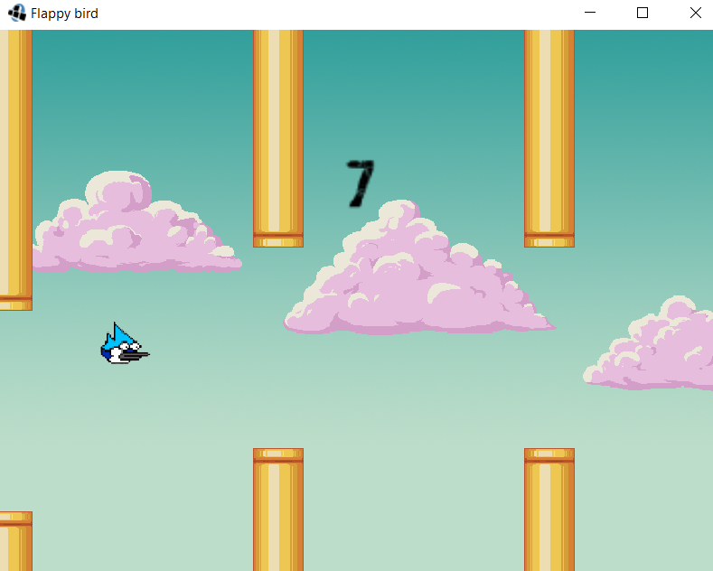
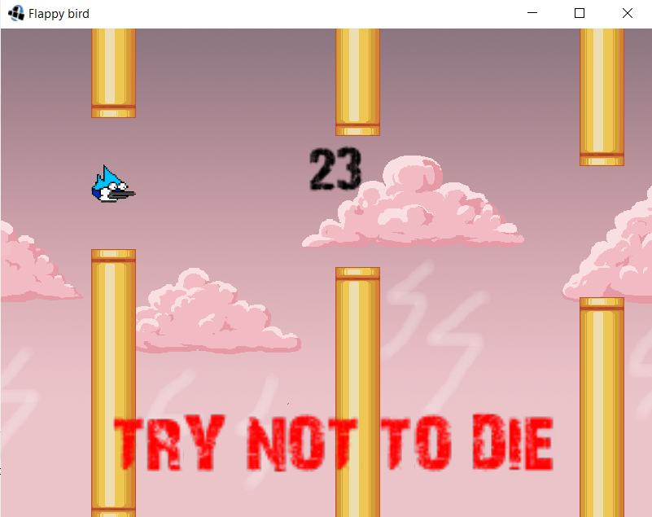

# Flappy Bird

This is a recreation of the well-familiar game Flappy Bird. It's built with libGDX library and Java, and it's my first
game ever created.

## Similarities and differences

The gameplay is practically identical to the original. The main goal of the game is to pass as many tubes as possible.
The gaps between tubes shrink as the player goes forward.

It also has very funny Mordecai bird, soundtrack and changing background with "TRY NOT TO DIE!" poping out once you
reach score of 20 passed tubes.

## Difficulties and shortcomings

The problem I struggled the most with was tracking correctly the number of passed tubes. It sometimes adds up 2 points
for 1 passed tube. I still didn't figure out why it does so.

Another major bug is checkboxes. Due to the specific shape of the bird it registers collisions incorrectly as I wrapped
up the bird with a simple square checkbox. 